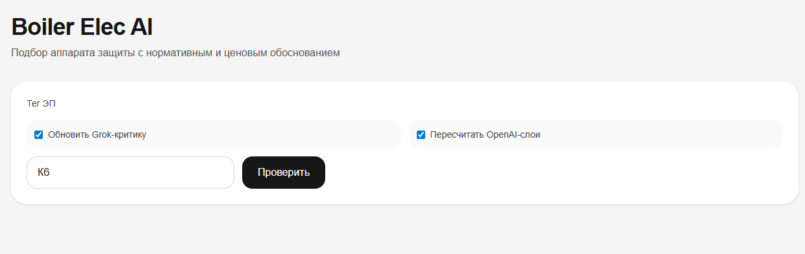
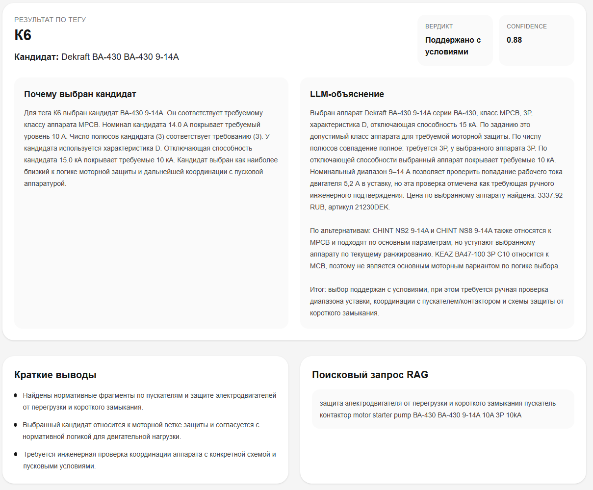
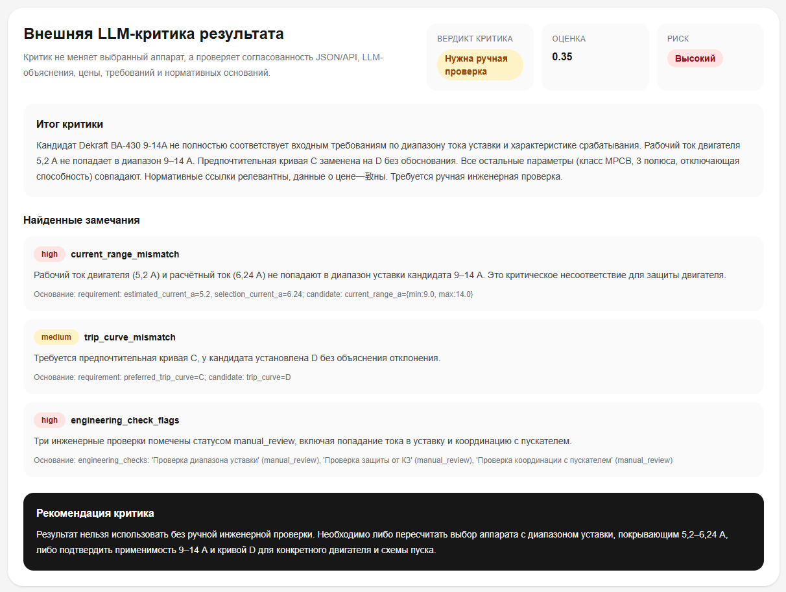
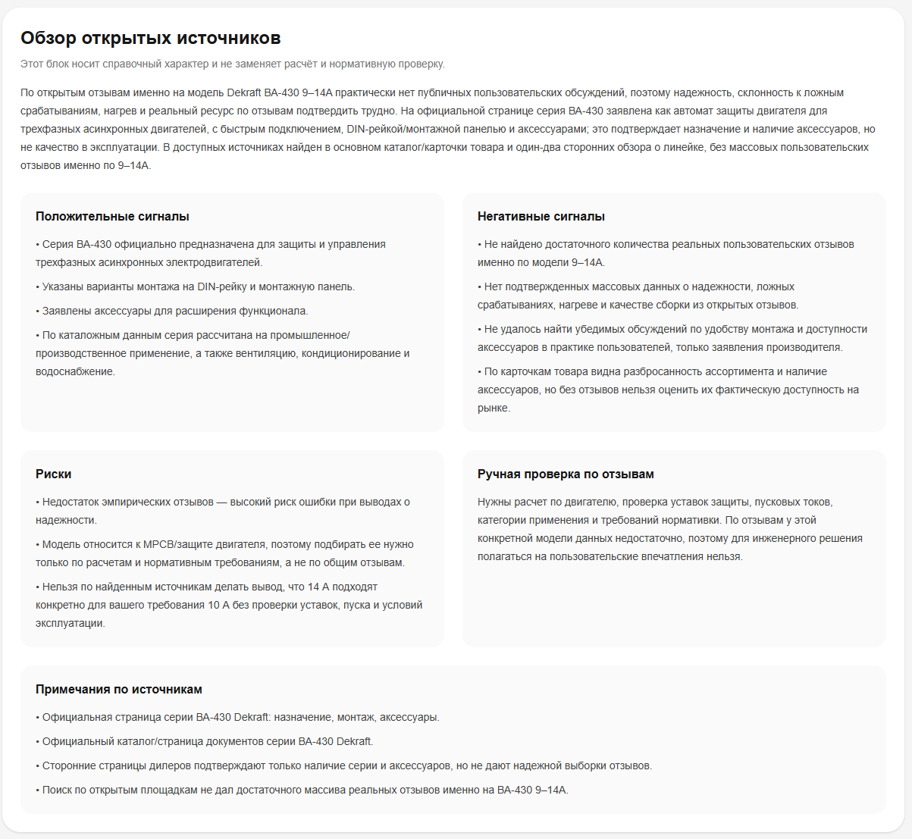
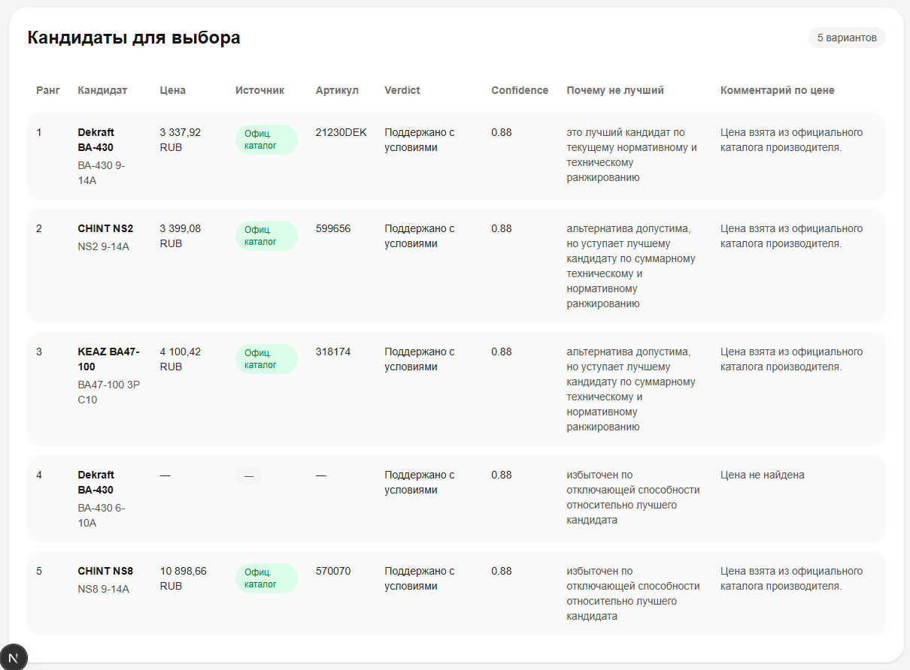

# Boiler Elec AI

**Boiler Elec AI** — MVP инженерной системы поддержки проектирования электроснабжения котельной.

Проект автоматизирует часть рутинной работы инженера-проектировщика: извлечение оборудования из проектных PDF и паспортов, формирование электрических параметров, калибровку токов, заполнение Excel-шаблона расчёта нагрузок, формирование требований к аппаратам защиты, подбор кандидатов из каталогов, нормативное обоснование, LLM-проверку результата и просмотр итогов через пользовательский frontend-интерфейс.

> Статус проекта: **MVP / research prototype**.  
> Система не заменяет инженера-проектировщика. Все результаты должны проходить ручную инженерную проверку.

---

## 1. Основные возможности

Проект реализует несколько связанных контуров:

1. **Извлечение оборудования из проектных PDF**
   - чтение схем и разделов проекта;
   - извлечение тегов оборудования;
   - разворачивание диапазонов тегов, например `К5.1-К5.3`, `ГГ.1-ГГ.4`, `А1-А4`;
   - определение класса оборудования: насос, горелка, вентиляция, шкаф, освещение, электрообогрев;
   - определение рабочих, резервных и сухорезервных единиц.

2. **Парсинг паспортов оборудования**
   - извлечение мощности, напряжения, номинального тока, числа фаз, КПД;
   - отдельная обработка паспортов горелок Baltur TBG;
   - отдельная обработка ХВО;
   - формирование отчёта о недостающих параметрах.

3. **Инженерный расчётный контур**
   - калибровка расчётного тока по паспортному току;
   - формирование итогового списка электроприёмников;
   - заполнение Excel-шаблона расчёта нагрузок;
   - пересчёт формул строк нагрузок, секций шин, УКРМ и итогов ВРУ.

4. **Подбор аппаратов защиты**
   - формирование требований к защитному аппарату;
   - выбор класса аппарата: `MCB`, `MPCB`, `MCCB`, `RCBO`;
   - подбор кандидатов из нормализованного каталога;
   - построение shortlist по каждому тегу.

5. **Каталожно-ценовое обогащение**
   - построение технического каталога аппаратов из PDF-каталогов;
   - сбор цен с открытых сайтов производителей;
   - нормализация прайс-каталога;
   - сопоставление технических кандидатов с ценами и артикулами.

6. **Нормативный RAG**
   - построение корпуса нормативных документов;
   - offline keyword retrieval внутри основного pipeline;
   - расширенный hybrid/Qdrant retrieval для FastAPI-демонстрации;
   - формирование нормативного объяснения и инженерных проверок.

7. **LLM-слой**
   - OpenAI-объяснение выбора аппарата;
   - OpenAI fallback для цен;
   - OpenAI-поиск отзывов/обсуждений;
   - Grok-критик как внешний LLM-контроль результата.

8. **FastAPI-интерфейс**
   - API по тегу оборудования;
   - HTML-страница проверки тега;
   - возможность обновлять AI-объяснение и Grok-критику через query-параметры.

9. **Frontend-интерфейс**
   - отдельное пользовательское приложение в папке `frontend/`;
   - визуальная работа с результатами подбора по тегам оборудования;
   - отображение кандидата, альтернатив, нормативного обоснования, ценового блока и AI-критики;
   - удобный сценарий демонстрации MVP без ручного просмотра JSON-файлов.

---

## 2. Текущая структура проекта


```text
boiler_elec_ai/
├─ data/
│  ├─ input/
│  │  ├─ schemes/
│  │  │  └─ 25-05/
│  │  ├─ passports/
│  │  │  └─ 25-05/
│  │  ├─ templates/
│  │  └─ catalogs/
│  ├─ output/
│  │  └─ runs/
│  │     └─ 25-05/
│  ├─ catalogs/
│  └─ cache/
│
├─ frontend/
│  ├─ app/
│  │  ├─ globals.css
│  │  ├─ layout.tsx
│  │  └─ page.tsx
│  ├─ public/
│  ├─ package.json
│  ├─ package-lock.json
│  ├─ next.config.ts
│  ├─ tsconfig.json
│  ├─ eslint.config.mjs
│  └─ README.md
│
├─ history/
├─ models/
├─ scripts/
│
├─ src/
│  ├─ ai/
│  │  ├─ enrich_normative_review_llm.py
│  │  ├─ enrich_normative_review_openai.py
│  │  ├─ grok_critic.py
│  │  ├─ price_miner_gemini.py
│  │  ├─ price_miner_openai.py
│  │  ├─ review_miner_gemini.py
│  │  ├─ review_miner_groq.py
│  │  ├─ review_miner_openai.py
│  │  └─ review_miner.py
│  │
│  ├─ app/
│  │  ├─ main.py
│  │  └─ rag_fastapi.py
│  │
│  ├─ config/
│  │  └─ env.py
│  │
│  ├─ domain/
│  │  ├─ taxonomy.py
│  │  └─ taxonomy.yaml
│  │
│  ├─ engine/
│  │  ├─ ai_catalog_review.py
│  │  ├─ ai_classification_review.py
│  │  ├─ ai_consistency_review.py
│  │  ├─ ai_entity_review.py
│  │  ├─ ai_normative_review.py
│  │  ├─ ai_project_summary.py
│  │  ├─ build_normative_qdrant.py
│  │  ├─ busbars.py
│  │  ├─ calibrate.py
│  │  ├─ classifier.py
│  │  ├─ consistency_checker.py
│  │  ├─ entity_resolution.py
│  │  ├─ normative_corpus_builder.py
│  │  ├─ normative_qdrant_store.py
│  │  ├─ normative_retriever.py
│  │  ├─ normative_review.py
│  │  ├─ normative_summarizer.py
│  │  ├─ phase_sums.py
│  │  ├─ rag_pipeline.py
│  │  ├─ requirements_builder.py
│  │  ├─ retriever.py
│  │  ├─ selector.py
│  │  ├─ shortlist.py
│  │  └─ test_normative_retriever.py
│  │
│  ├─ excel/
│  │  ├─ excel_identity.py
│  │  └─ writer.py
│  │
│  ├─ extract/
│  │  ├─ catalogs/
│  │  │  ├─ build_catalog_json.py
│  │  │  ├─ build_price_catalog.py
│  │  │  ├─ group_catalog_for_fastapi.py
│  │  │  ├─ merge_catalog_with_prices.py
│  │  │  └─ normalize_price_catalog.py
│  │  ├─ norms/
│  │  │  └─ build_normative_corpus.py
│  │  ├─ passports/
│  │  │  └─ passport_parser.py
│  │  ├─ schemes/
│  │  │  ├─ pdf_layout.py
│  │  │  └─ scheme_parser.py
│  │  └─ pdf_text.py
│  │
│  ├─ interact/
│  │  └─ questionnaire.py
│  │
│  ├─ models/
│  │  └─ equipment.py
│  │
│  ├─ pipeline/
│  │  └─ run_pipeline.py
│  │
│  └─ utils/
│     └─ normalize.py
│
├─ tools/
│  ├─ calc_price_metrics_from_saved_api.py
│  ├─ calc_price_metrics_offline.py
│  ├─ calc_price_metrics.py
│  ├─ grok_critic.py
│  ├─ make_api_short.py
│  └─ vkr_collect_metrics.py
│
├─ .env.example
├─ .gitignore
├─ requirements.txt
└─ README.md
```

## 3. Подготовка окружения

### 3.1. Перейти в корень проекта

```powershell
cd BOILER_ELEC_AI
```

### 3.2. Создать и активировать виртуальное окружение

```powershell
python -m venv .venv
.\.venv\Scripts\activate
```

### 3.3. Установить зависимости

```powershell
pip install -r requirements.txt
```

Если используется локальная embedding-модель, она должна лежать по пути:

```text
models/Frida
```

В текущем MVP в командах и настройках по умолчанию используется локальная модель эмбеддингов `models/Frida`. Это не жёсткое архитектурное ограничение: вместо Frida может использоваться другая embedding-модель, совместимая с `sentence-transformers`. Для замены необходимо указать другой путь или имя модели в параметре `--model_name` при построении Qdrant-индекса и, при необходимости, привести формат кодирования запроса/документа в соответствие с руководством выбранной модели.

---

## 4. Настройка `.env`

В корне проекта создаётся файл `.env`.

Пример:

```env
OPENAI_API_KEY=your_openai_api_key
XAI_API_KEY=your_xai_api_key

GROK_CRITIC_ENABLED=1
GROK_CRITIC_MODEL=grok-4.3
GROK_CRITIC_REASONING=1

OPENAI_NORMATIVE_MODEL=gpt-4.1
OPENAI_REVIEW_MODEL=gpt-4.1
OPENAI_PRICE_MODEL=gpt-4.1

OPENAI_MAX_CANDIDATES_PER_TAG=5
```

Файл `.env` нельзя коммитить в git.

---

## 5. Подготовка входных данных

Для текущего демонстрационного проекта используется код:

```text
25-05
```

Ожидаемая структура входных данных:

```text
data/input/schemes/25-05/
data/input/passports/25-05/
data/input/templates/
data/input/catalogs/
norms/
```

Назначение папок:

```text
data/input/schemes/25-05/      проектные PDF-разделы и схемы
data/input/passports/25-05/    паспорта оборудования
data/input/templates/          Excel-шаблон расчёта нагрузок ВРУ
data/input/catalogs/           PDF-каталоги аппаратов защиты
norms/                         нормативные PDF для RAG
```

---

## 6. Запуск основного инженерного pipeline

Основной offline pipeline запускается командой:

```powershell
python -m src.app.main `
  --project_code "25-05" `
  --schemes_dir "data\input\schemes\25-05" `
  --passports_dir "data\input\passports\25-05" `
  --template_xlsx "data\input\templates\25-05_Расчет нагрузок ВРУ 20.05.25.xlsx" `
  --out_dir "data\output\runs\25-05" `
  --norms_dir "norms"
```

Эта команда выполняет основной расчётный сценарий:

```text
1. Извлечение registry из проектных PDF.
2. Парсинг паспортов оборудования.
3. Сопоставление проектных сущностей с паспортами.
4. Классификация оборудования.
5. Расширение насосных групп по ТМ.
6. Добавление ОВ, шкафов, освещения, электрообогрева.
7. Калибровка токов.
8. Формирование Excel-идентификаторов.
9. Проверка согласованности данных.
10. Формирование требований к аппаратам защиты.
11. Подбор кандидатов из каталога.
12. Формирование shortlist.
13. Offline retrieval по нормативному корпусу.
14. Формирование RAG summary.
15. Формирование AI diagnostic review.
16. Запись результата в Excel-шаблон.
```

После успешного запуска результат сохраняется в:

```text
data/output/runs/25-05/
```

---

## 7. Основные выходные файлы pipeline

После запуска должны появиться:

```text
equipment_registry.json
passports_parsed.json
entity_links.json
classification_report_initial.json
classification_report.json
items_final.json
consistency_report.json
requirements.json
candidates.json
shortlist.json
retrieved_chunks.json
rag_summary.json
ai_entity_review.json
ai_classification_review.json
ai_consistency_review.json
ai_catalog_review.json
ai_normative_review.json
ai_project_summary.json
result_25-05.xlsx
audit_log.csv
write_log.txt
```

Самые важные файлы для проверки:

```text
result_25-05.xlsx
items_final.json
requirements.json
candidates.json
shortlist.json
rag_summary.json
ai_project_summary.json
```

---

## 8. Если не хватает исходных параметров

Если после первого запуска видно, что части оборудования не хватает мощности, напряжения, тока или фазности, можно запустить интерактивный опрос:

```powershell
python -m src.interact.questionnaire `
  --passports_parsed "data\output\runs\25-05\passports_parsed.json" `
  --items_final "data\output\runs\25-05\items_final.json" `
  --out_user_inputs "data\output\runs\25-05\user_inputs.json" `
  --only_missing
```

После заполнения `user_inputs.json` основной pipeline нужно запустить повторно:

```powershell
python -m src.app.main `
  --project_code "25-05" `
  --schemes_dir "data\input\schemes\25-05" `
  --passports_dir "data\input\passports\25-05" `
  --template_xlsx "data\input\templates\25-05_Расчет нагрузок ВРУ 20.05.25.xlsx" `
  --out_dir "data\output\runs\25-05" `
  --norms_dir "norms"
```

---

## 9. Построение технического каталога аппаратов

Технический каталог строится из PDF-каталогов CHINT, DEKRAFT, KEAZ.

```powershell
python -m src.extract.catalogs.build_catalog_json `
  --catalogs_dir "data\input\catalogs" `
  --out_metadata "data\catalogs\catalog_metadata.json" `
  --out_corpus "data\catalogs\catalog_corpus.json"
```

После этого основной pipeline сможет использовать:

```text
data/catalogs/catalog_metadata.json
```

Если в `data/output/runs/25-05/` есть файл:

```text
catalog_normalized.json
```

то он будет иметь приоритет над общим каталогом из `data/catalogs/`.

---

## 10. Сбор и нормализация цен

### 10.1. Сбор цен с сайтов производителей

```powershell
python -m src.extract.catalogs.build_price_catalog `
  --out "data\output\runs\25-05\price_catalog.json" `
  --max_links_per_category 120
```

Скрипт обращается к открытым страницам CHINT, DEKRAFT и KEAZ.

### 10.2. Нормализация прайс-каталога

```powershell
python -m src.extract.catalogs.normalize_price_catalog `
  --input "data\output\runs\25-05\price_catalog.json" `
  --out "data\output\runs\25-05\price_catalog_normalized.json"
```

### 10.3. Обогащение кандидатов ценами

```powershell
python -m src.extract.catalogs.merge_catalog_with_prices `
  --catalog_json "data\output\runs\25-05\shortlist.json" `
  --price_json "data\output\runs\25-05\price_catalog_normalized.json" `
  --out "data\output\runs\25-05\catalog_with_prices.json"
```

### 10.4. Группировка для FastAPI

```powershell
python -m src.extract.catalogs.group_catalog_for_fastapi `
  --input "data\output\runs\25-05\catalog_with_prices.json" `
  --out "data\output\runs\25-05\catalog_with_prices_grouped.json"
```

---

## 11. Построение нормативного корпуса для Qdrant

Этот шаг нужен для расширенного нормативного RAG в FastAPI.

### 11.1. Сбор `normative_corpus.json`

```powershell
python -m src.extract.norms.build_normative_corpus `
  --norms_dir "norms" `
  --out_json "data\output\runs\25-05\normative_corpus.json"
```

### 11.2. Построение локальной Qdrant-коллекции

```powershell
python -m src.engine.build_normative_qdrant `
  --corpus "data\output\runs\25-05\normative_corpus.json" `
  --qdrant_path "data\output\runs\25-05\qdrant" `
  --collection "normative_chunks" `
  --model_name "models\Frida"
```

---

## 12. Запуск FastAPI

```powershell
uvicorn src.app.rag_fastapi:app --reload
```

После запуска API будет доступно по адресу:

```text
http://127.0.0.1:8000
```

---

## 13. Проверка API по тегу

Пример для тега `К6`:

```powershell
curl "http://127.0.0.1:8000/api/tag/%D0%9A6"
```

Или в браузере:

```text
http://127.0.0.1:8000/api/tag/К6
```

HTML-страница проверки:

```text
http://127.0.0.1:8000/tag/К6
```

---

## 14. Обновление AI-слоёв через API

### 14.1. Обновить OpenAI-объяснение

```powershell
curl "http://127.0.0.1:8000/api/tag/%D0%9A6?refresh_ai=true"
```

### 14.2. Обновить Grok-критику

```powershell
curl "http://127.0.0.1:8000/api/tag/%D0%9A6?refresh_critic=true"
```

### 14.3. Обновить и OpenAI, и Grok

```powershell
curl "http://127.0.0.1:8000/api/tag/%D0%9A6?refresh_ai=true&refresh_critic=true"
```

---

## 15. Запуск frontend-интерфейса

В проекте реализован отдельный пользовательский frontend в папке:

```text
frontend/
```

Он нужен для удобной демонстрации MVP: вместо просмотра JSON-ответов вручную пользователь работает с интерфейсом, который обращается к FastAPI backend и отображает результат по выбранному тегу оборудования.

Перед запуском frontend должен быть запущен backend:

```powershell
uvicorn src.app.rag_fastapi:app --reload
```

После этого в отдельном терминале:

```powershell
cd frontend
npm install
npm run dev
```

Обычно frontend будет доступен по адресу:

```text
http://localhost:3000
```

Backend по умолчанию работает на:

```text
http://127.0.0.1:8000
```

Если frontend-код обращается к backend по фиксированному адресу `http://127.0.0.1:8000`, дополнительная настройка не требуется. Достаточно сначала запустить FastAPI backend, затем frontend.

## Демонстрация интерфейса и объяснение функционала

### Главная страница frontend



Здесь видно, что можно проставить галочки на двух пунктах: "Обновить Grok-критику" и "Пересчитать OpenAI-слои" - это сделано с целью, если в папке `data/output/runs/25-05` есть OpenAI-слои и в папке `data/output/runs/25-05/critic` есть Grok-критика, то необходимость в простановке галочки пропадает. В начале первого включения рекомендуется проставлять галочки в обоих случаях. По умолчанию в строке ввода проставляется тег `К6` в качестве примера.
### Карточка результата по тегу c LLM-объяснением




### Блок AI-критики




### Блок с обзором открытых источников



### Блок со списком кандидатов




## 16. Просмотр технических метрик (опционально)

Метрики являются вспомогательным инструментом. Они нужны не для обязательного запуска системы, а для быстрой проверки отдельных параметров карточек ЭП: наличия требования, выбранного кандидата, альтернатив, нормативных фрагментов, LLM-текста, цены и источника цены.

### 16.1. Сбор метрик по API

```powershell
python -m tools.vkr_collect_metrics `
  --out_dir "data\output\runs\25-05" `
  --tags "К6,К5,ГГ.1" `
  --base_url "http://127.0.0.1:8000" `
  --use_api
```

После выполнения появятся:

```text
vkr_metrics_summary.json
vkr_metrics_by_tag.json
vkr_metrics_summary.csv
vkr_metrics_by_tag.csv
```

### 16.2. Метрики цены по сохранённым API-ответам

```powershell
python -m tools.calc_price_metrics_from_saved_api
```

Результат:

```text
data/output/runs/25-05/price_coverage_metrics.json
```

---

## 17. Типовой порядок полного запуска

Рекомендуемый порядок запуска MVP:

```text
1. Установить зависимости.
2. Подготовить .env.
3. Разложить входные PDF/XLSX по папкам data/input.
4. Построить технический каталог аппаратов.
5. Запустить основной engineering pipeline.
6. Если есть недостающие параметры — заполнить user_inputs.json через questionnaire.
7. Повторно запустить основной pipeline.
8. Собрать price_catalog.json.
9. Нормализовать price_catalog.
10. Обогатить shortlist ценами.
11. Сгруппировать catalog_with_prices для FastAPI.
12. Построить нормативный Qdrant-store.
13. Запустить FastAPI backend.
14. Запустить frontend.
15. Проверить результат через интерфейс или `/api/tag/К6`.
16. При необходимости обновить OpenAI/Grok-слои.
17. При необходимости собрать метрики для быстрого просмотра и проверки параметров карточек ЭП.
```

---

## 18. Ограничения MVP

Текущая версия проекта имеет следующие ограничения:

```text
1. Парсинг PDF зависит от качества текстового слоя и структуры документа.
2. Для некоторых паспортов используются эвристики и специальные правила.
3. Расчёт токов короткого замыкания пока не реализован как полноценный отдельный модуль.
4. Подбор аппаратов защиты выполняется по упрощённым инженерным правилам.
5. Ценовой парсер зависит от структуры сайтов производителей.
6. Нормативный RAG не является юридическим заключением.
7. LLM-объяснение может ошибаться и должно проверяться по JSON-данным.
8. Grok-критик является вспомогательным контролем, а не окончательным решением.
9. Итоговый выбор аппарата должен проверяться инженером-проектировщиком.
10. Frontend является демонстрационным интерфейсом MVP и зависит от доступности FastAPI backend.
```

---

## 19. Пример демонстрационного сценария

Для демонстрации удобно использовать тег:

```text
К6
```

Проверка:

```powershell
curl "http://127.0.0.1:8000/api/tag/%D0%9A6?refresh_ai=true&refresh_critic=true"
```

Ожидаемый смысл демонстрации:

```text
1. API возвращает требование к защитному аппарату.
2. Показывается выбранный кандидат и альтернативы.
3. Отображаются нормативные основания.
4. Добавляется LLM-объяснение выбора.
5. Grok-критик проверяет согласованность результата.
6. Результат можно просмотреть через API, встроенную HTML-страницу FastAPI или отдельный frontend.
7. При спорном инженерном случае выставляется manual_review_required.
```

---

## 20. Назначение проекта

Проект демонстрирует применимость гибридного подхода к поддержке инженерного проектирования:

```text
engineering rules + PDF parsing + Excel automation + catalog matching + RAG + LLM review
```

в задаче поддержки проектирования электроснабжения котельной.

Главная идея: не заменить инженера, а сократить объём ручной подготовки данных, ускорить первичный подбор аппаратов защиты и подсветить места, требующие инженерной проверки.
